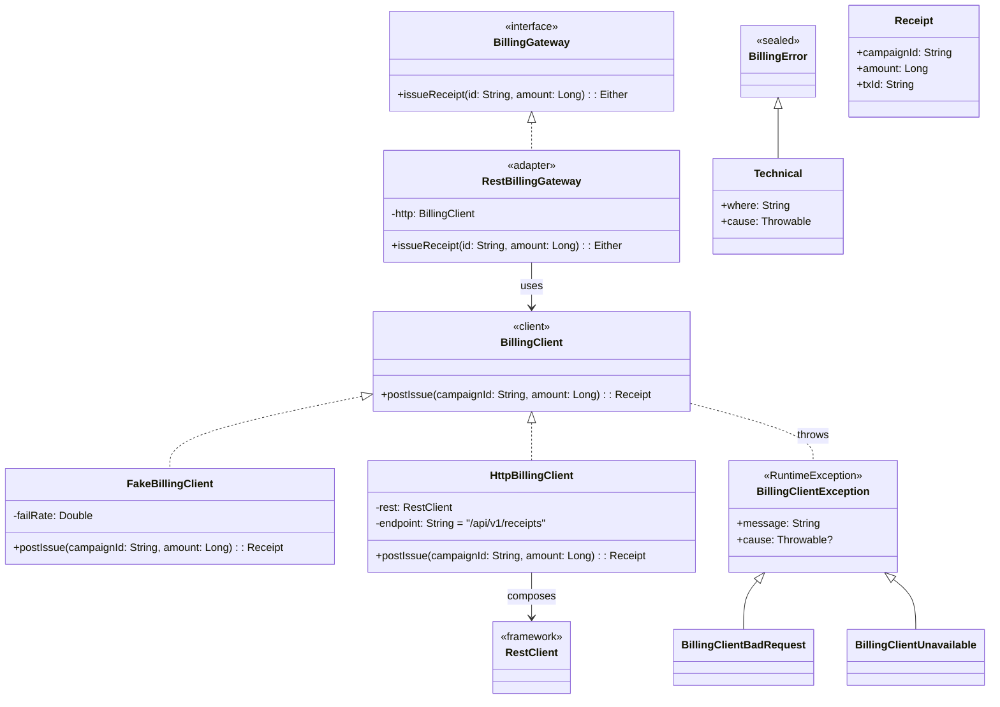

### 클래스 다이어그램 (Ports & Adapters + 예외/도메인 모델)

**해설 요약**

* `BillingGateway`는 **Port(도메인 인터페이스)**, `RestBillingGateway`는 **Adapter(인프라)**.
* Adapter는 `BillingClient`(외부 청구 시스템 클라이언트)를 사용해 **HTTP 호출을 감싸고**,
  발생한 `BillingClientException`을 **도메인 타입드 에러**(`BillingError.Technical`)로 **매핑**하여 `Either.Left`로 반환.
* 성공 시 `Receipt`를 `Either.Right`로 반환.
* `BillingClient` 구현은 **Fake**(테스트용) / **HttpBillingClient**(실서비스용) 두 가지.

---

### 시퀀스 다이어그램 (호출 흐름 & 에러 매핑)

**핵심 포인트**

* **성공 경로**: `Receipt` → `Either.Right`.
* **실패 경로**: `BillingClientException`(외부/HTTP/직렬화 등) → **어댑터에서** `BillingError.Technical`로 **변환** → `Either.Left`.
* 상위(Service/UseCase/Controller)는 **타입드 에러**만 받으므로, HTTP 상태 매핑/사용자 메시지/재시도 정책 등을 **도메인 규칙대로** 결정하기 쉽습니다.

